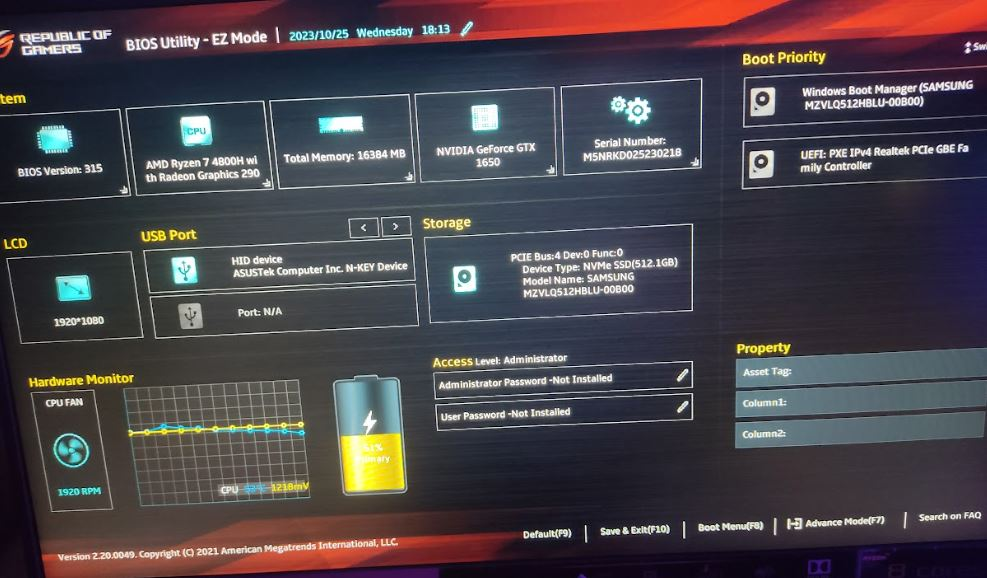
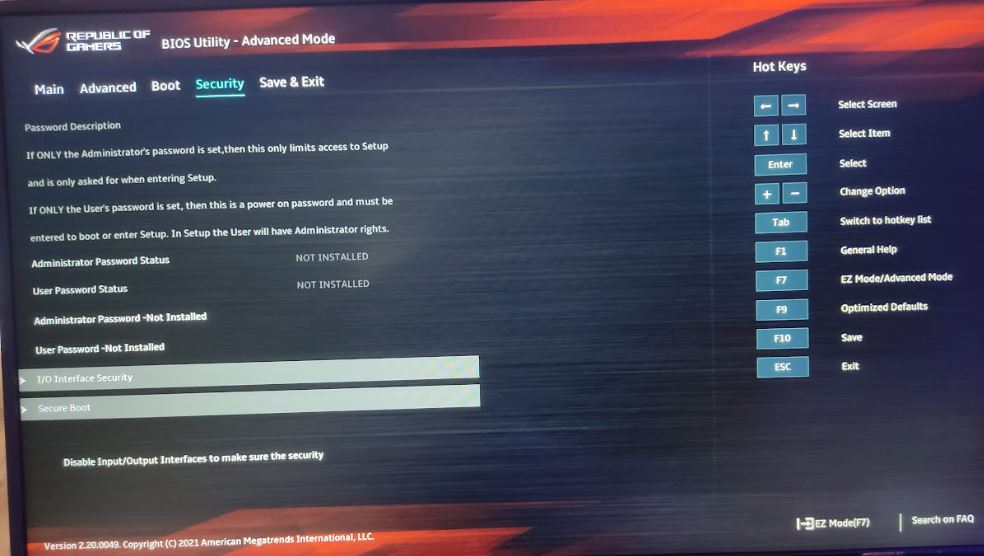
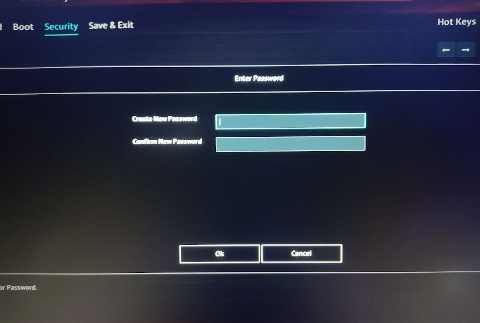
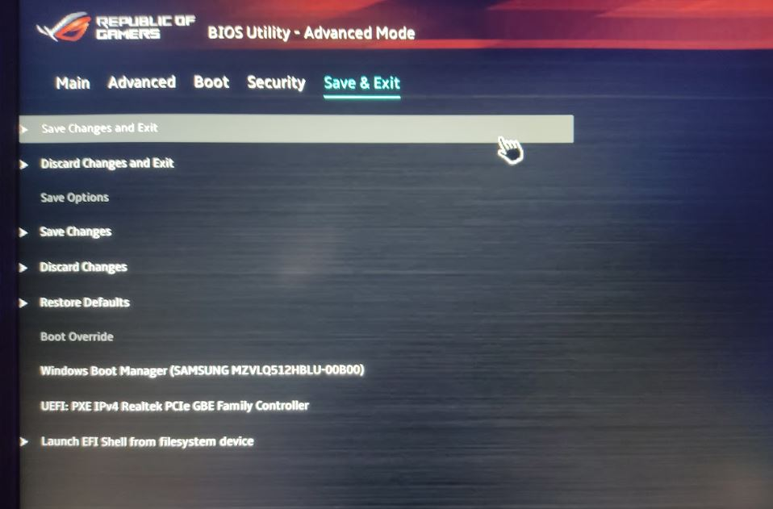
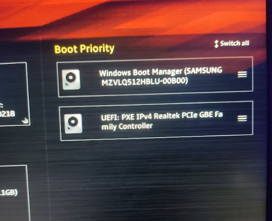

# Proyecto 1: Bastionado del arranque del sistema

author: Placido Diaz
summary: Summary of your codelab that is human readable
id: unique-codelab-identifier
categories: codelab,markdown,internet computer
environments: Web
status: Published
feedback link: A link where users can go to provide feedback (e.g. the git repo)
analytics account: Google Analytics ID

---

## **Introducción**

**Última modificanción:** 2023-10-25

**¿Qué se explica en este documento?**

En ente documento se muestra una guía en la que configuramos los parámetros necesarios en la BIOS para aportar seguridad al sistema. Ya que es muy sencillo manipular el arranque para conseguir acceso al dispositivo.

**¿Sobre qué modelo se ha realizado la práctica?**

El modelo utilizado en este trabajo corresponde a una UEFI modelo American Megatrends International, LLC. G513IH.315, 26/11/2021

---

## **Entrar en la BIOS/UEFI**

Duration: 2:00

### ¿Cómo acceder?
Lo primero que debemos hacer es buscar que tecla inicia la BIOS/UEFI de nuestro ordenador, aunque varía dependiendo del modelo de la tarjeta madre. Esto se hace usualmente presionando la tecla F2 o Supr. Presione la tecla adecuada hasta que aparezca el menú de configuración.

---

## **Contraseña de usuario/administrador en arranque**

Duration: 2:00

Una vez dentro de la UEFI:

1. Vamos al apartado “Seguridad”, aquí veremos las opciones “Contraseña de administrador y “Contraseña de usuario”. Lo único que deberemos hacer, es presionar doble clic sobre la opción que deseemos. 

2. Al realizar lo anterior, escribiremos la contraseña y presionamos Enter, se le pedirá ingresar otra vez la contraseña, hágalo y presione entrar.

3. Luego de hacer los cambios, nos dirijimos hacia la pestaña “Salida”. Haga clic sobre la opción “Guardar cambios y salir”. Tras esto los cambios deberían guardarse y al arrancar otra vez UEFI, se pedirá la contraseña.

---

## **Arranque desde dispositivos externos**

Duration: 1:30

Una vez dentro de la UEFI:

1. **Navega a la configuración de arranque:** Una vez en la BIOS, busca la opción de "Boot". Puede estar en una pestaña diferente dependiendo de la versión de la BIOS.

3. **Prioridad de arranque:** Busca la opción de "Boot Priority". Aquí deberías ver una lista de dispositivos de almacenamiento como disco duro, CD/DVD y USB.

4. **Desactiva los dispositivos externos:** En la lista de dispositivos de arranque, desactiva o cambia la prioridad de los dispositivos USB o externos a un nivel más bajo. Puedes hacerlo moviendo el dispositivo de almacenamiento externo hacia abajo en la lista de prioridades.

5. **Guarda y reinicia:** Guarda los cambios y sal de la BIOS. Asegúrate de que los ajustes se guardan antes de reiniciar tu computadora.

---

## **Orden de arranque seguro**

Duration: 3:00

El orden de arranque seguro (Secure Boot) puede variar ligeramente según la implementación específica de la placa base y el firmware UEFI. Sin embargo, aquí hay un orden general de los componentes que participan en el proceso de arranque seguro:

- **Firmware UEFI:** El firmware UEFI es el primer componente que se activa cuando se enciende una computadora. Verifica la firma digital de los componentes que participan en el proceso de arranque.

- **Cargador de arranque firmado:** Después de verificar la integridad del firmware UEFI, se carga el cargador de arranque firmado, como el gestor de arranque GRUB o el Administrador de arranque de Windows. Este cargador de arranque también debe estar firmado digitalmente y aprobado por la UEFI.

- **Sistema operativo firmado:** Una vez que se ha cargado el cargador de arranque, se verifica la firma del kernel o del sistema operativo antes de cargarlo. El sistema operativo debe estar firmado digitalmente con una clave de confianza que el firmware UEFI reconoce.

En el caso de cualquier violación de la integridad, como una firma no reconocida o ausente, el arranque seguro detendrá el proceso de arranque y notificará al usuario que existe un problema de seguridad.

---

## **Otras opciones de seguridad diferentes**

Duration: 3:00

Estas son otras formas de asegurar la UEFI:

1. **Monitorización y registro de eventos de firmware:** Habilita la monitorización y el registro de eventos de firmware para detectar cualquier actividad sospechosa o cambios no autorizados en la configuración de UEFI

2. **Firmware digitalmente firmado:** Habilita la verificación de firmas digitales para garantizar que solo el firmware firmado digitalmente por el fabricante se ejecute durante el inicio del sistema. Esto puede evitar que el sistema se inicie con firmware malintencionado.

3. **Actualización regular del firmware:** Asegúrate de que el firmware UEFI esté actualizado con las últimas correcciones de seguridad y actualizaciones del fabricante. Las actualizaciones de firmware a menudo contienen parches para vulnerabilidades conocidas.