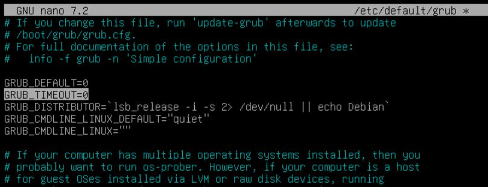

# Proyecto 1: Bastionado del arranque del sistema

author: Placido Diaz
summary: Summary of your codelab that is human readable
id: unique-codelab-identifier
categories: codelab,markdown,internet computer
environments: Web
status: Published
feedback link: A link where users can go to provide feedback (e.g. the git repo)
analytics account: Google Analytics ID


---


## **Introducción**


**Última modificanción:** 2023-10-25

**¿Qué se explica en este documento?**

En ente documento se muestra una guía en la que configuramos los parámetros necesarios en la BIOS para aportar seguridad al sistema. Ya que es muy sencillo manipular el arranque para conseguir acceso al dispositivo.

**¿Sobre qué modelo se ha realizado la práctica?**

Este trabajo corresponde con una instalación de Debian 12.2.0


---

## **Ocultar menú de arranque**

Duration: 2:00

Una vez dentro de la máquina deberemos editar el fichero **/etc/default/grub**. Para cambiar el tiempo de aparicion del gentor de arranque deberemos tocar el parámetro **GRUB_TIMEOUT**



Para guarda los cambios tendremos que colocar el comando **update-grub**

---

## **Configurar una contraseña modificar el arranque**

Duration: 1:30

Para poder colocar una contraseña en el gestor de arranque debemos cifrar primero la contraseña con **sudo grub-mkpasswd-pbkdf2**.

Ahora accedereos a **/etc/grub.d/40_custom**, una vez aquí dentro colocaremos lo siguiente:
````
set superusers="nombre-usuario"
password_pbkdf2 nombre-usuario hash-password
````
Para guarda los cambios tendremos que colocar el comando **update-grub**.

Al arrancar de nuevo nos pedirá el usuario y su contraseña.

---

## **Crear una copia de seguridad de la configuración del arranque**

Duration: 1:00

Para realizar una realizar una copia de seguridad de la configuración del  grub2 hay que respaldar estos tres elementos:
- Archivo /etc/default/grub
- Directorio /etc/grub.d/ 
- Archivo /boot/grub/grub.cfg 

---

## **Otras opciones de seguridad diferentes**

Duration: 3:00

Estas son otras formas de asegurar el arranque:

- **Utilizar Secure Boot:** Esto ayuda a proteger el proceso de arranque y garantiza que solo el software firmado digitalmente por un fabricante de confianza se ejecute durante el arranque.

- **Restricción de arranque desde dispositivos externos:** Restringir el arranque desde dispositivos externos como USB o CD/DVD. Esto previene posibles ataques que podrían comprometer GRUB a través de medios externos.

- **Configuración de permisos de archivos:** Asegurar que los archivos de configuración relacionados con GRUB tengan los permisos adecuados. Restringe los permisos de lectura y escritura para los archivos de configuración de GRUB para evitar la manipulación no autorizada.